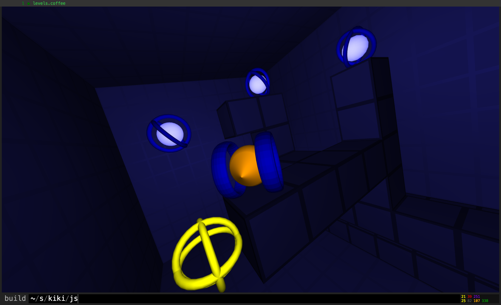

### to try it out

```
git clone git@github.com:monsterkodi/kiki.git
cd kiki
npm install
npm run kiki
```

### development

```
npm run build    # to compile coffee sources to js
npm run watch    # run in watch mode (reloads itself when sources change)
npm run pack     # to build executable
```